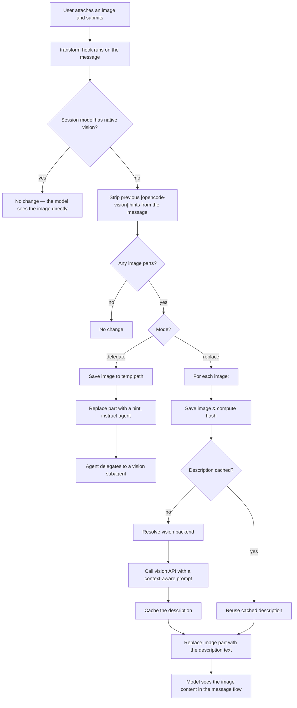

# opencode-vision

An [opencode](https://opencode.ai) plugin that automatically describes images attached to your messages, so models **without** native vision support can still "see" them.

## How it works

When an image is attached to a message, the plugin:

1. Checks whether the current session's model supports images natively. If it does, nothing happens.
2. Otherwise calls a vision-capable model and injects the description into the conversation as:

   ```
   [opencode-vision] Image: <description>
   (saved: <path to the image on disk>)
   ```

3. Caches descriptions in memory (deduped by image hash), so re-attaching the same image never re-analyzes it.

The description is generated by the vision model **in the same language as your message**, so no UI text needs to be localized.



### Modes

- **delegate** (default): the image is saved to a temp path and the agent is instructed to delegate analysis to a vision subagent (e.g. `@vision`). On first run the plugin **auto-creates** `~/.config/opencode/agent/vision.md` (a free `opencode/mimo-v2.5-free` vision subagent) if none exists, so it works out of the box — restart opencode once after creation.
- **replace** (opt-in): the image part is replaced inline with a text description from a vision model (OpenAI-compatible backends only). Enable with `"experimental.vision.mode": "replace"`.

The delegate path uses opencode's own model routing (correct for every model family), so it never needs hand-crafted requests or endpoint whitelists.

## Install

Copy `opencode-vision.ts` into your opencode plugins directory and restart opencode.

```bash
# Linux / macOS
cp opencode-vision.ts ~/.config/opencode/plugins/

# Windows
copy opencode-vision.ts %USERPROFILE%\.config\opencode\plugins\
```

## Configuration

### Choosing the vision model

The plugin resolves the vision backend in this order:

1. A custom `provider["vision-aux"]` entry in `opencode.json`.
2. The choice file at `~/.config/opencode/vision-model.txt`, containing a `provider/model` id.
3. The default `opencode/mimo-v2.5-free`.

You can also switch models from inside a session: ask the agent to run the `vision_models` tool to list candidates, then `vision_set_model` to persist a choice.

> **Free default**: the default `opencode/mimo-v2.5-free` runs on the free tier of the zen gateway — you only need a free login key: `opencode auth login`. Other free zen models exist too (e.g. `opencode/deepseek-v4-flash-free`, `opencode/hy3-free`). The plugin briefly mentions this on first use and lets you switch anytime.

> **Zen multi-protocol routing**: the zen gateway serves different model families over different APIs (OpenAI `responses`, Anthropic `messages`, Google, OpenAI-compatible `chat/completions`). Replace mode calls the OpenAI-compatible `chat/completions` API, so it only advertises models from compatible families (`deepseek`, `minimax`, `glm`, `kimi`, `mimo`, `hy3`, `laguna`, `nemotron`, `big-pickle`). If you choose a model from another family (e.g. `opencode/qwen3.6-plus`), the plugin automatically falls back to **delegate mode**, where the agent delegates to a vision subagent and opencode's own model routing handles the protocol — no hand-crafted request needed.

### opencode.json

```jsonc
{
  "provider": {
    "vision-aux": {
      "options": {
        "baseURL": "https://example.com/v1",
        "apiKey": "sk-...",
        "model": "some-model"
      }
    }
  },
  "experimental": {
    "vision": {
      "mode": "delegate", // "delegate" (default) | "replace"
      "subagent": "vision",
      "model": "opencode/mimo-v2.5-free" // optional "provider/model" override for the vision backend
    }
  }
}
```

The provider API key is read from `~/.local/share/opencode/auth.json`; config-declared providers are also discovered automatically.

## Acknowledgements

This plugin was inspired by and adapts ideas from:

- [JochenYang/opencode-vision](https://github.com/JochenYang/opencode-vision) — image saving + guiding non-vision models via tool calling.
- [WeZZard/opencode-vision](https://github.com/WeZZard/opencode-vision) — dynamic visual-response skill for OpenCode.
- [Nous Research — Hermes Function Calling (Hermes Agent)](https://github.com/NousResearch/Hermes-Function-Calling) — capability-aware routing and context-aware content substitution.

## Development

```bash
bun install
bun run build      # bundle into dist/
bun run typecheck  # type-check the plugin
```

## License

MIT
